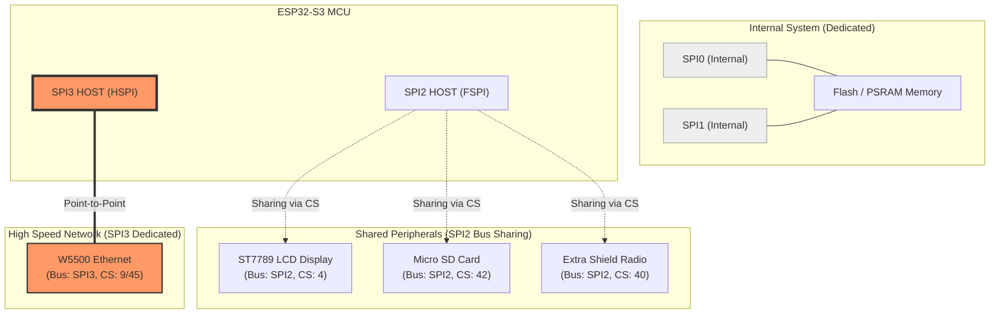

# LilyGO T-ETH 시리즈 SPI 및 하드웨어 사양 정리

본 문서는 LilyGO T-ETH 시리즈(특히 ESP32-S3 기반) 프로젝트에서 사용하는 주요 하드웨어 스펙과 SPI 채널 사용 현황을 정리한 것입니다.

---

## 1. SPI 버스 아키텍처 도식화

ESP32-S3는 총 4개의 SPI 인터페이스를 가지고 있으며, 본 프로젝트에서는 이를 다음과 같이 분할하여 사용합니다.

---

## 2. SPI 채널별 상세 역할

| 채널 ID | 내부 명칭 | 용도 | 특징 |
| :--- | :--- | :--- | :--- |
| **SPI0** | - | **Internal Memory** | 시스템 전용. 외부 Flash 및 PSRAM 캐시 제어에 사용됩니다. |
| **SPI1** | - | **Memory Direct** | 시스템 전용. Flash/PSRAM 직접 접근 및 펌웨어 쓰기 시 사용됩니다. |
| **SPI2** | **FSPI** | **주변기기 공유 버스** | LCD, SD 카드, LoRa 등 **여러 모듈이 물리적 핀을 공유**하며 CS 제어로 번갈아 사용합니다. |
| **SPI3** | **HSPI** | **이더넷 전용 버스** | 네트워크 처리 성능 극대화를 위해 **W5500 칩 하나만 독점**하여 사용합니다. |

> [!NOTE]
> **SPI2 공유 방식:** LCD와 SD 카드는 동일한 데이터 라인(SCLK, MOSI, MISO)을 사용하더라도, 각자의 **CS(Chip Select)** 핀이 다릅니다. MCU는 통신하고자 하는 장치의 CS 핀만 `LOW`로 떨어뜨려 데이터 충돌 없이 여러 장치를 제어합니다.

---

## 3. 하드웨어 사양 및 핀맵 (참조)

보드 버전에 따라 핀 할당이 다르므로 개발 시 주의가 필요합니다.

### 🌐 T-ETH-Lite-ESP32S3 (S3 중심)

| 컴포넌트 | 버스 명칭 | MOSI | MISO | SCLK | CS | 비고 |
| :--- | :--- | :--- | :--- | :--- | :--- | :--- |
| **Ethernet** | **SPI3** | 12 | 11 | 10 | 9 | **전용** |
| **LCD** | SPI2 | 3 | 1 | 2 | 4 | 공유 |
| **SD Card** | SPI2 | 6 | 5 | 7 | 42 | 공유 |

### 🌐 T-ETH-Elite-ESP32S3 (확장형)

Elite 버전은 LoRa 등 외부 모듈 확장을 위해 SPI2 핀맵이 더욱 통합되어 있습니다.

| 컴포넌트 | 버스 명칭 | MOSI | MISO | SCLK | CS | 비고 |
| :--- | :--- | :--- | :--- | :--- | :--- | :--- |
| **Ethernet** | **SPI3** | 21 | 47 | 48 | 45 | **전용** |
| **SD Card** | SPI2 | 11 | 9 | 10 | 12 | 공유 |
| **Radio (LoRa)** | SPI2 | 11 | 9 | 10 | 40 | 공유 |

---

## 4. 아케텍처 설계 이점
네트워크 패킷은 무작위로 발생하므로, 이를 LCD 화면 갱신이나 SD 카드 읽기 작업과 같은 버스에 두면 심각한 지연(Jitter)이 발생합니다. 본 프로젝트는 **SPI3를 오직 이더넷에만 할당**함으로써, 화면 작업 중에도 끊김 없는 고속 네트워크 브릿지 성능을 보장합니다.
